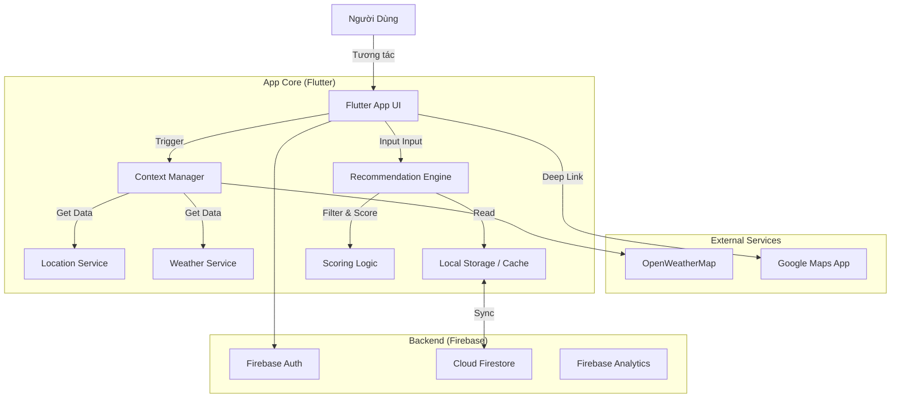

Chào bạn, đây là bước quan trọng nhất để chuyển từ "Ý tưởng" sang "Sản phẩm thực tế". Dựa trên file `overview_flutter.md` đã chốt, tôi thiết kế file `system_flow.md` tập trung vào sự rõ ràng của luồng dữ liệu và tư duy kiến trúc **Clean & Agile**.

Mục tiêu của thiết kế này: **Code ít, Hiệu quả cao, Dễ nâng cấp.**

-----

# SYSTEM FLOW & BUILD STRATEGY: "Hôm Nay Ăn Gì?"

## PHẦN I: SYSTEM OPERATION FLOW (Luồng Hoạt Động Hệ Thống)

### 1\. High-Level Architecture Diagram

Mô hình hoạt động theo hướng **Client-Centric** (Xử lý logic tại App) để tối ưu tốc độ và chi phí Firebase.



### 2\. User Journey Flow (Luồng Người Dùng Chi Tiết)

Quy trình từ lúc mở App đến lúc chốt món ăn:

**Bước 1: Initialization (Khởi tạo ngầm)**

  * App mở -\> Check Login.
  * *Parallel Task:* Lấy GPS -\> Gọi Weather API -\> Xác định: "Trưa, Nắng, 35 độ".
  * Load Cache món ăn từ Local Storage (nếu có) để App mượt ngay lập tức.

**Bước 2: Dashboard Trigger**

  * Hiển thị Dashboard với câu chào theo Context.
  * User bấm nút **"Gợi Ý"**.

**Bước 3: Quick Input (Thu thập biến số)**

  * Hiển thị BottomSheet 3 câu hỏi nhanh:
    1.  Túi tiền (Rẻ/Vừa/Sang).
    2.  Đi cùng ai (Một mình/Date/Nhóm).
    3.  Mood (Vui/Buồn/Stress - Optional).

**Bước 4: Processing (The Black Box)**

  * **Input:** [Profile User] + [Weather Context] + [Quick Input].
  * **Action:** Chạy thuật toán lọc và tính điểm trên danh sách 50-100 món ăn.
  * **Output:** Top 3 món có điểm cao nhất.

**Bước 5: Result & Action**

  * Hiển thị món ăn Top 1 (kèm nút xem món tiếp theo).
  * User chọn **"Tìm Quán"** -\> Hệ thống tạo Deep Link: `google.com/maps/search/?api=1&query=Bún+bò+huế+gần+đây`.
  * App mở Google Maps ứng dụng ngoài.

-----

## PHẦN II: DATA FLOW & ALGORITHM LOGIC

Đây là cách dữ liệu di chuyển và biến đổi để tạo ra gợi ý "thông minh".

### 1\. Pipeline Xử Lý Dữ Liệu

```text
[Raw Food List] 
      ⬇
[Hard Filter] -> Loại bỏ món Dị ứng, Món quá Budget, Món đóng cửa.
      ⬇
[Context Scoring] -> Nhân hệ số (Mưa x1.5 cho Lẩu, Nắng x1.2 cho Cuốn).
      ⬇
[Personalization] -> Cộng điểm món User hay ăn, Trừ điểm món vừa ăn hôm qua.
      ⬇
[Randomization] -> Thêm điểm ngẫu nhiên (0-10%) để tạo bất ngờ.
      ⬇
[Final Sort] -> Lấy Top 3.
```

### 2\. Cơ chế Sync Data (Offline First)

Để App nhanh "như gió", không chờ mạng load mỗi lần bấm:

  * **Lần đầu mở App:** Tải toàn bộ danh sách món (chỉ text & link ảnh, rất nhẹ \~50kb) từ Firestore về lưu vào Local DB (Hive/Isar).
  * **Các lần sau:** Load từ Local DB.
  * **Background Sync:** Khi có mạng, App check version trên Firestore, nếu có update món mới thì tải ngầm về update Local DB.

-----

## PHẦN III: BUILD STRATEGY (Chiến lược Xây dựng Clean & Agile)

Để đảm bảo code sạch nhưng vẫn dev nhanh, tôi đề xuất kiến trúc **Feature-First + Repository Pattern**. Không dùng Clean Architecture quá phức tạp (Enterprise level) vì sẽ làm chậm tiến độ dự án MVP.

### 1\. Folder Structure (Cấu trúc thư mục)

Chia theo tính năng (Feature) giúp dễ tìm code và dễ chia việc nếu có thêm người làm.

```text
lib/
├── main.dart
├── core/                   # Các thành phần dùng chung
│   ├── constants/          # Màu sắc, Font, String cố định
│   ├── services/           # WeatherService, LocationService, AnalyticsService
│   ├── utils/              # Helper functions (Format tiền, Date time)
│   └── widgets/            # Button, Card, Input dùng chung
│
├── data/                   # Quản lý dữ liệu (Chỉ lo việc lấy/lưu data)
│   ├── models/             # FoodModel, UserModel
│   ├── repositories/       # FoodRepository (Quyết định lấy từ Cache hay API)
│   └── sources/            # FirebaseClient, LocalStorageClient
│
├── features/               # Các chức năng chính
│   ├── auth/               # Login, Register UI & Logic
│   ├── onboarding/         # Màn hình hỏi sở thích ban đầu
│   ├── dashboard/          # Màn hình chính
│   └── recommendation/     # QUAN TRỌNG NHẤT
│       ├── logic/          # ScoringEngine.dart (Thuật toán nằm ở đây)
│       ├── widgets/        # InputBottomSheet, ResultCard
│       └── screens/        # ResultScreen
│
└── config/                 # Theme, Route
```

### 2\. Tech Stack & Packages (Tối ưu cho Flutter)

  * **State Management:** `flutter_riverpod` (Gọn, mạnh, dễ test hơn Provider/Bloc cho dự án này).
  * **Local Database:** `hive` (Siêu nhanh, NoSQL, hợp lưu object món ăn).
  * **Network/API:** `dio` (Gọi Weather API).
  * **Dependency Injection:** Tận dụng `Riverpod` để inject service.
  * **Utilities:** `geolocator` (Vị trí), `url_launcher` (Mở Map), `logger`.

### 3\. Quy trình Dev "Nhanh nhẹn" (Agile Steps)

Đừng làm tuần tự Front-end xong mới làm Back-end. Hãy làm theo **Vertical Slice** (Cắt dọc tính năng).

**Giai đoạn 1: The Walking Skeleton (Khung xương biết đi)**

  * Dựng Project, cài thư viện.
  * Tạo Mock Data (Dữ liệu giả) cứng trong code: List 10 món ăn.
  * Viết `ScoringEngine` cơ bản: Input vào -\> Random ra kết quả từ 10 món đó.
  * Hiển thị lên màn hình xấu cũng được.
  * *Mục tiêu:* Bấm nút là ra kết quả (dù là giả).

**Giai đoạn 2: The Data Connection (Kết nối dữ liệu)**

  * Setup Firestore. Upload 50 món thật.
  * Viết Repository để App lấy data từ Firestore thay vì Mock Data.
  * Lưu vào Hive (Cache).

**Giai đoạn 3: The Brain (Lắp não - Logic thật)**

  * Code thuật toán chấm điểm thật (Weather, Budget).
  * Gắn API Weather vào.
  * Tinh chỉnh hệ số chấm điểm.

**Giai đoạn 4: The Beauty (Làm đẹp)**

  * Vẽ lại UI Dashboard.
  * Thêm Animation lúc "Quay số/Gợi ý".
  * Thêm các câu Joke (Copywriting).

-----
