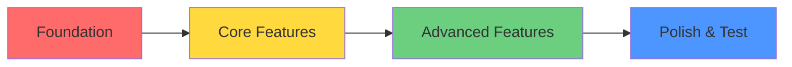
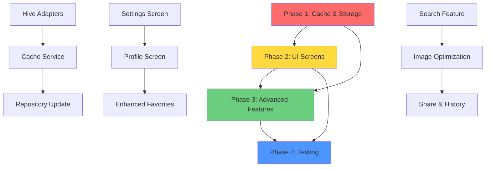

# 🎯 Kế Hoạch Cải Thiện Dự Án "Hôm Nay Ăn Gì?"

> **Phiên bản:** 1.0  
> **Ngày tạo:** 2025-12-13  
> **Loại trừ:** Các tác vụ Firebase Console (security rules, seeding data) sẽ thực hiện riêng

---

## 📋 MỤC LỤC

1. [Tổng quan chiến lược](#1-tổng-quan-chiến-lược)
2. [Phase 1: Local Storage & Cache (Tuần 1-2)](#phase-1-local-storage--cache)
3. [Phase 2: UI Screens Completion (Tuần 3-4)](#phase-2-ui-screens-completion)
4. [Phase 3: Advanced Features (Tuần 5-6)](#phase-3-advanced-features)
5. [Phase 4: Testing & Optimization (Tuần 7-8)](#phase-4-testing--optimization)
6. [Dependencies Graph](#dependencies-graph)
7. [File Structure Plan](#file-structure-plan)

---

## 1. TỔNG QUAN CHIẾN LƯỢC

### Nguyên tắc triển khai



### Priority Matrix

| Priority | Focus Area | Tác động | Độ phức tạp |
|----------|-----------|---------|-------------|
| 🔴 P0 | Hive Cache Implementation | Cao | Trung bình |
| 🟠 P1 | Settings & Profile Screens | Cao | Thấp |
| 🟡 P2 | Advanced Features | Trung bình | Trung bình |
| 🟢 P3 | Testing & Polish | Thấp | Cao |

### Estimated Timeline

```
Week 1-2: Local Storage & Cache     ████████░░░░░░░░ 50%
Week 3-4: UI Screens                ████████████░░░░ 75%
Week 5-6: Advanced Features         ████████████████ 100%
Week 7-8: Testing & Optimization    ████████████████ 100%
```

**Tổng thời gian:** 8 tuần (2 tháng)

---

## PHASE 1: LOCAL STORAGE & CACHE

**Mục tiêu:** Hoàn thiện offline-first architecture với Hive

**Timeline:** Tuần 1-2 (10-14 ngày)

### 1.1 Hive Adapters Implementation

#### Task 1.1.1: FoodModel Hive Adapter
**File:** `lib/models/food_model.dart`

**Steps:**
1. Thêm import Hive
   ```dart
   import 'package:hive/hive.dart';
   
   part 'food_model.g.dart';
   ```

2. Annotate class
   ```dart
   @HiveType(typeId: 0)
   class FoodModel extends HiveObject {
     @HiveField(0)
     final String id;
     @HiveField(1)
     final String name;
     // ... các fields khác
   }
   ```

3. Thêm helper methods
   ```dart
   // Serialize nested maps/lists
   @HiveField(10)
   final String contextScoresJson; // JSON.encode(contextScores)
   
   Map<String, double> get contextScores => 
       Map<String, double>.from(json.decode(contextScoresJson));
   ```

**Deliverable:** 
- ✅ `food_model.g.dart` generated
- ✅ Type adapter registered

**Effort:** 2-3 ngày

---

#### Task 1.1.2: UserModel Hive Adapter
**File:** `lib/models/user_model.dart`

**Steps:**
1. Annotate UserModel + nested classes
   ```dart
   @HiveType(typeId: 1)
   class UserModel extends HiveObject { ... }
   
   @HiveType(typeId: 2)
   class UserInfo { ... }
   
   @HiveType(typeId: 3)
   class UserSettings { ... }
   
   @HiveType(typeId: 4)
   class UserStats { ... }
   ```

2. Handle DateTime serialization
   ```dart
   @HiveField(5)
   final int createdAtMillis; // DateTime.millisecondsSinceEpoch
   
   DateTime get createdAt => 
       DateTime.fromMillisecondsSinceEpoch(createdAtMillis);
   ```

**Deliverable:**
- ✅ All user-related models have adapters
- ✅ Nested objects properly handled

**Effort:** 2 ngày

---

#### Task 1.1.3: Code Generation
**Command:** `dart run build_runner build --delete-conflicting-outputs`

**Files generated:**
- `food_model.g.dart`
- `user_model.g.dart`

**Effort:** 30 phút

---

### 1.2 Enhanced Cache Service

#### Task 1.2.1: Hive-based CacheService
**File:** `lib/core/services/cache_service.dart`

**Current:** In-memory cache với TTL  
**Target:** Persistent Hive cache

**Implementation:**

```dart
import 'package:hive/hive.dart';
import '../../models/food_model.dart';

class CacheService {
  static const String _foodBoxName = 'foods_cache';
  static const String _metaBoxName = 'cache_meta';
  static const Duration _defaultTtl = Duration(hours: 24);
  
  late Box<FoodModel> _foodBox;
  late Box<dynamic> _metaBox;
  
  // Singleton pattern
  static final CacheService _instance = CacheService._internal();
  factory CacheService() => _instance;
  CacheService._internal();
  
  Future<void> init() async {
    _foodBox = await Hive.openBox<FoodModel>(_foodBoxName);
    _metaBox = await Hive.openBox(_metaBoxName);
  }
  
  // Save with timestamp
  Future<void> saveFoodsToCache(List<FoodModel> foods) async {
    await _foodBox.clear();
    for (var food in foods) {
      await _foodBox.put(food.id, food);
    }
    await _metaBox.put('last_updated', DateTime.now().millisecondsSinceEpoch);
    await _metaBox.put('version', 1);
  }
  
  // Retrieve with TTL check
  Future<List<FoodModel>> getFoodsFromCache() async {
    if (!isCacheValid()) return [];
    return _foodBox.values.toList();
  }
  
  bool isCacheValid() {
    final lastUpdated = _metaBox.get('last_updated') as int?;
    if (lastUpdated == null) return false;
    
    final age = DateTime.now().millisecondsSinceEpoch - lastUpdated;
    return age < _defaultTtl.inMilliseconds;
  }
  
  Future<void> clearCache() async {
    await _foodBox.clear();
    await _metaBox.clear();
  }
  
  // Cache versioning for migration
  int get cacheVersion => _metaBox.get('version', defaultValue: 0) as int;
  
  Future<void> invalidateIfVersionMismatch(int serverVersion) async {
    if (cacheVersion < serverVersion) {
      await clearCache();
    }
  }
}
```

**Deliverable:**
- ✅ Persistent cache
- ✅ TTL enforcement
- ✅ Version control
- ✅ Migration support

**Effort:** 3-4 ngày

---

#### Task 1.2.2: Update FoodRepository
**File:** `lib/features/recommendation/data/repositories/food_repository.dart`

**Changes:**
1. Replace in-memory cache với Hive cache
2. Add background sync strategy
3. Improve offline fallback

```dart
class FoodRepository {
  final FoodFirestoreService _firestoreService;
  final CacheService _cacheService;
  
  FoodRepository() 
      : _firestoreService = FoodFirestoreService(),
        _cacheService = CacheService();
  
  Future<List<FoodModel>> getAllFoods() async {
    // Strategy 1: Try cache first (offline-first)
    final cachedFoods = await _cacheService.getFoodsFromCache();
    if (cachedFoods.isNotEmpty && _cacheService.isCacheValid()) {
      AppLogger.info('Using cached foods (${cachedFoods.length} items)');
      
      // Background sync if online
      _syncInBackground();
      
      return cachedFoods;
    }
    
    // Strategy 2: Fetch from Firestore
    try {
      AppLogger.info('Fetching foods from Firestore...');
      final foods = await _firestoreService.fetchAllFoods();
      
      // Save to cache
      await _cacheService.saveFoodsToCache(foods);
      
      return foods;
    } catch (e) {
      // Strategy 3: Fallback to expired cache if available
      if (cachedFoods.isNotEmpty) {
        AppLogger.warning('Firestore failed, using stale cache');
        return cachedFoods;
      }
      rethrow;
    }
  }
  
  Future<void> _syncInBackground() async {
    try {
      final foods = await _firestoreService.fetchAllFoods();
      await _cacheService.saveFoodsToCache(foods);
      AppLogger.info('Background sync completed');
    } catch (e) {
      AppLogger.error('Background sync failed: $e');
    }
  }
  
  // Force refresh (pull-to-refresh)
  Future<void> refreshFoods() async {
    await _cacheService.clearCache();
    await getAllFoods();
  }
}
```

**Deliverable:**
- ✅ Offline-first working
- ✅ Background sync
- ✅ Graceful degradation

**Effort:** 2-3 ngày

---

### 1.3 Initialization Update

#### Task 1.3.1: Update main.dart
**File:** `lib/main.dart`

```dart
void main() async {
  await AppErrorHandler.runGuarded(() async {
    WidgetsFlutterBinding.ensureInitialized();

    // Initialize Hive
    await Hive.initFlutter();
    
    // Register adapters
    Hive.registerAdapter(FoodModelAdapter());
    Hive.registerAdapter(UserModelAdapter());
    Hive.registerAdapter(UserInfoAdapter());
    Hive.registerAdapter(UserSettingsAdapter());
    Hive.registerAdapter(UserStatsAdapter());
    
    // Initialize cache service
    await CacheService().init();
    
    // Initialize Firebase
    await Firebase.initializeApp(
      options: DefaultFirebaseOptions.currentPlatform,
    );
    
    // ... rest of init
  });
}
```

**Effort:** 1 ngày

---

### Phase 1 Summary

**Total Effort:** 10-14 ngày

**Checklist:**
- [x] Hive adapters cho FoodModel
- [x] Hive adapters cho UserModel
- [x] Code generation chạy thành công
- [x] CacheService refactor sang Hive
- [x] FoodRepository update với offline-first
- [x] Background sync implemented
- [x] main.dart initialization updated
- [x] Testing cache flows

**Validation:**
```bash
# Test offline mode
1. Load app với internet
2. Tắt internet
3. Restart app → Vẫn thấy foods
4. Bật internet → Background sync tự động
```

---

## PHASE 2: UI SCREENS COMPLETION

**Timeline:** Tuần 3-4 (10-14 ngày)

### 2.1 Settings Screen

#### Task 2.1.1: Create Settings Screen
**File:** `lib/features/settings/presentation/settings_screen.dart`

**UI Structure:**

```
┌─────────────────────────────┐
│  ← Cài Đặt                  │
├─────────────────────────────┤
│                             │
│  👤 Tài Khoản               │
│  ├─ Thông tin cá nhân      │
│  └─ Đổi mật khẩu           │
│                             │
│  🍽️ Sở Thích Ăn Uống        │
│  ├─ Ngân sách mặc định     │
│  ├─ Độ cay chịu được       │
│  ├─ Dị ứng thực phẩm       │
│  └─ Món không thích        │
│                             │
│  🎨 Giao Diện               │
│  ├─ Chế độ tối/sáng        │
│  └─ Ngôn ngữ               │
│                             │
│  📊 Dữ Liệu                 │
│  ├─ Xóa cache              │
│  └─ Đồng bộ lại           │
│                             │
│  🚪 Đăng xuất               │
└─────────────────────────────┘
```

**Implementation:**

```dart
class SettingsScreen extends ConsumerWidget {
  const SettingsScreen({super.key});

  @override
  Widget build(BuildContext context, WidgetRef ref) {
    final userProfile = ref.watch(userProfileStreamProvider);
    
    return Scaffold(
      appBar: AppBar(title: const Text('Cài Đặt')),
      body: userProfile.when(
        data: (user) => _buildSettings(context, ref, user),
        loading: () => const LoadingIndicator(),
        error: (e, st) => ErrorWidget(message: e.toString()),
      ),
    );
  }
  
  Widget _buildSettings(BuildContext context, WidgetRef ref, UserModel? user) {
    return ListView(
      children: [
        _buildSection(
          title: 'Tài Khoản',
          children: [
            _buildAccountTile(context, user),
            _buildChangePasswordTile(context),
          ],
        ),
        
        _buildSection(
          title: 'Sở Thích Ăn Uống',
          children: [
            _buildBudgetTile(context, ref, user),
            _buildSpiceTile(context, ref, user),
            _buildAllergiesTile(context, ref, user),
            _buildBlacklistTile(context, ref, user),
          ],
        ),
        
        _buildSection(
          title: 'Giao Diện',
          children: [
            _buildThemeTile(context, ref),
          ],
        ),
        
        _buildSection(
          title: 'Dữ Liệu',
          children: [
            _buildClearCacheTile(context, ref),
            _buildSyncTile(context, ref),
          ],
        ),
        
        const SizedBox(height: 24),
        _buildLogoutButton(context, ref),
      ],
    );
  }
  
  // Individual tile builders...
}
```

**Widgets needed:**
- `BudgetSelectorDialog` - Chọn budget 1-3
- `SpiceToleranceSlider` - Slider 0-5
- `AllergiesPickerDialog` - Multi-select allergens
- `BlacklistFoodsDialog` - List món không thích

**Deliverable:**
- ✅ Settings screen hoàn chỉnh
- ✅ All preferences editable
- ✅ Changes persist to Firestore
- ✅ UI responsive

**Effort:** 4-5 ngày

---

### 2.2 Profile Screen

#### Task 2.2.1: Create Profile Screen
**File:** `lib/features/profile/presentation/profile_screen.dart`

**UI Structure:**

```
┌─────────────────────────────┐
│                             │
│      [Avatar Image]         │
│      Nguyễn Văn A          │
│    user@email.com          │
│                             │
├─────────────────────────────┤
│  📊 Thống Kê                │
│  ┌───────┬────────┬────────┐│
│  │ 🔥 5  │ 🍜 42  │ ⭐ 89  ││
│  │ Streak│ Picked │ Points ││
│  └───────┴────────┴────────┘│
│                             │
│  📜 Lịch Sử Gần Đây         │
│  ├─ Phở bò (2h trước)      │
│  ├─ Cơm tấm (Hôm qua)      │
│  └─ Bánh mì (2 ngày trước) │
│                             │
│  ❤️ Món Yêu Thích (8)       │
│  ⚙️ Cài Đặt                 │
└─────────────────────────────┘
```

**Implementation:**

```dart
class ProfileScreen extends ConsumerWidget {
  const ProfileScreen({super.key});

  @override
  Widget build(BuildContext context, WidgetRef ref) {
    final userProfile = ref.watch(userProfileStreamProvider);
    final history = ref.watch(recommendationProvider).history;
    
    return Scaffold(
      body: userProfile.when(
        data: (user) => _buildProfile(context, ref, user, history),
        loading: () => const LoadingIndicator(),
        error: (e, st) => ErrorWidget(message: e.toString()),
      ),
    );
  }
  
  Widget _buildProfile(
    BuildContext context, 
    WidgetRef ref, 
    UserModel? user,
    List<FoodModel> history,
  ) {
    return CustomScrollView(
      slivers: [
        _buildAppBar(context, user),
        _buildStats(user?.stats),
        _buildRecentHistory(history),
        _buildQuickActions(context),
      ],
    );
  }
}
```

**Deliverable:**
- ✅ Profile screen với stats
- ✅ Recent history display
- ✅ Edit profile capability
- ✅ Navigation to settings

**Effort:** 3-4 ngày

---

### 2.3 Enhanced Favorites Screen

#### Task 2.3.1: Complete Favorites Screen
**File:** `lib/features/favorites/presentation/favorites_screen.dart`

**Current:** Basic stub  
**Target:** Full-featured favorites management

**Features to add:**
1. Add/Remove favorites
2. Grid/List view toggle
3. Search within favorites
4. Sort by (date added, name, price)
5. Swipe to delete

**Implementation:**

```dart
class FavoritesScreen extends ConsumerStatefulWidget {
  const FavoritesScreen({super.key});

  @override
  ConsumerState<FavoritesScreen> createState() => _FavoritesScreenState();
}

class _FavoritesScreenState extends ConsumerState<FavoritesScreen> {
  bool _isGridView = true;
  String _searchQuery = '';
  String _sortBy = 'date'; // date, name, price
  
  @override
  Widget build(BuildContext context) {
    final favorites = ref.watch(favoritesProvider);
    
    return Scaffold(
      appBar: AppBar(
        title: const Text('Món Yêu Thích'),
        actions: [
          IconButton(
            icon: Icon(_isGridView ? Icons.list : Icons.grid_view),
            onPressed: () => setState(() => _isGridView = !_isGridView),
          ),
          PopupMenuButton<String>(
            onSelected: (value) => setState(() => _sortBy = value),
            itemBuilder: (context) => [
              const PopupMenuItem(value: 'date', child: Text('Ngày thêm')),
              const PopupMenuItem(value: 'name', child: Text('Tên món')),
              const PopupMenuItem(value: 'price', child: Text('Giá tiền')),
            ],
          ),
        ],
      ),
      body: Column(
        children: [
          _buildSearchBar(),
          Expanded(
            child: favorites.when(
              data: (foods) => _buildFavoritesList(foods),
              loading: () => const LoadingIndicator(),
              error: (e, st) => ErrorWidget(message: e.toString()),
            ),
          ),
        ],
      ),
    );
  }
  
  Widget _buildFavoritesList(List<FoodModel> foods) {
    final filtered = _filterAndSort(foods);
    
    if (filtered.isEmpty) {
      return const EmptyStateWidget(
        message: 'Chưa có món yêu thích nào',
      );
    }
    
    return _isGridView
        ? _buildGridView(filtered)
        : _buildListView(filtered);
  }
  
  List<FoodModel> _filterAndSort(List<FoodModel> foods) {
    var result = foods;
    
    // Filter by search
    if (_searchQuery.isNotEmpty) {
      result = result.where((f) => 
        f.name.toLowerCase().contains(_searchQuery.toLowerCase())
      ).toList();
    }
    
    // Sort
    switch (_sortBy) {
      case 'name':
        result.sort((a, b) => a.name.compareTo(b.name));
        break;
      case 'price':
        result.sort((a, b) => a.priceSegment.compareTo(b.priceSegment));
        break;
      // 'date' is default (no sort needed)
    }
    
    return result;
  }
}
```

**New files needed:**
- `lib/features/favorites/data/favorites_repository.dart`
- `lib/features/favorites/logic/favorites_provider.dart`

**Deliverable:**
- ✅ Favorites CRUD operations
- ✅ Search & filter
- ✅ Multiple view modes
- ✅ Persist to Firestore

**Effort:** 3-4 ngày

---

### 2.4 Router Updates

#### Task 2.4.1: Add new routes
**File:** `lib/config/routes/app_router.dart`

```dart
GoRoute(
  path: '/settings',
  name: 'settings',
  pageBuilder: (context, state) => _buildSlidePage(
    state: state,
    child: const SettingsScreen(),
    offset: const Offset(0.06, 0),
  ),
),
GoRoute(
  path: '/profile',
  name: 'profile',
  pageBuilder: (context, state) => _buildSlidePage(
    state: state,
    child: const ProfileScreen(),
    offset: const Offset(0.06, 0),
  ),
),
```

**Effort:** 1 ngày

---

### Phase 2 Summary

**Total Effort:** 10-14 ngày

**Checklist:**
- [x] Settings Screen complete
- [x] Profile Screen complete
- [x] Enhanced Favorites Screen
- [x] Router updated
- [x] All screens responsive
- [x] Navigation flows tested

---

## PHASE 3: ADVANCED FEATURES

**Timeline:** Tuần 5-6 (10-14 ngày)

### 3.1 Search & Filter Feature

#### Task 3.1.1: Search Screen
**File:** `lib/features/search/presentation/search_screen.dart`

**Features:**
- Real-time search by name/keyword
- Filter by:
  - Price segment
  - Cuisine
  - Meal type
  - Allergens (exclude)
- Sort by:
  - Relevance
  - Price
  - Popularity (view_count)

**Implementation:**

```dart
class SearchScreen extends ConsumerStatefulWidget {
  const SearchScreen({super.key});

  @override
  ConsumerState<SearchScreen> createState() => _SearchScreenState();
}

class _SearchScreenState extends ConsumerState<SearchScreen> {
  final _searchController = TextEditingController();
  String _query = '';
  Set<int> _selectedPriceSegments = {};
  Set<String> _selectedCuisines = {};
  Set<String> _excludedAllergens = {};
  String _sortBy = 'relevance';
  
  @override
  Widget build(BuildContext context) {
    return Scaffold(
      appBar: AppBar(
        title: TextField(
          controller: _searchController,
          decoration: const InputDecoration(
            hintText: 'Tìm món ăn...',
            border: InputBorder.none,
          ),
          onChanged: (value) => setState(() => _query = value),
        ),
        actions: [
          IconButton(
            icon: const Icon(Icons.filter_list),
            onPressed: _showFilterDialog,
          ),
        ],
      ),
      body: _buildSearchResults(),
    );
  }
  
  Widget _buildSearchResults() {
    final allFoods = ref.watch(foodRepositoryProvider).getAllFoods();
    
    return FutureBuilder<List<FoodModel>>(
      future: allFoods,
      builder: (context, snapshot) {
        if (!snapshot.hasData) return const LoadingIndicator();
        
        final results = _filterFoods(snapshot.data!);
        
        if (results.isEmpty) {
          return const EmptyStateWidget(
            message: 'Không tìm thấy món ăn phù hợp',
          );
        }
        
        return ListView.builder(
          itemCount: results.length,
          itemBuilder: (context, index) {
            return FoodListTile(
              food: results[index],
              onTap: () => _navigateToDetail(results[index]),
            );
          },
        );
      },
    );
  }
  
  List<FoodModel> _filterFoods(List<FoodModel> foods) {
    var result = foods;
    
    // Search query
    if (_query.isNotEmpty) {
      result = result.where((f) => 
        f.name.toLowerCase().contains(_query.toLowerCase()) ||
        f.searchKeywords.any((k) => k.toLowerCase().contains(_query.toLowerCase()))
      ).toList();
    }
    
    // Price filter
    if (_selectedPriceSegments.isNotEmpty) {
      result = result.where((f) => 
        _selectedPriceSegments.contains(f.priceSegment)
      ).toList();
    }
    
    // Cuisine filter
    if (_selectedCuisines.isNotEmpty) {
      result = result.where((f) => 
        _selectedCuisines.contains(f.cuisineId)
      ).toList();
    }
    
    // Allergen exclusion
    if (_excludedAllergens.isNotEmpty) {
      result = result.where((f) => 
        !f.allergenTags.any((a) => _excludedAllergens.contains(a))
      ).toList();
    }
    
    // Sort
    _sortResults(result);
    
    return result;
  }
  
  void _sortResults(List<FoodModel> foods) {
    switch (_sortBy) {
      case 'price_low':
        foods.sort((a, b) => a.priceSegment.compareTo(b.priceSegment));
        break;
      case 'price_high':
        foods.sort((a, b) => b.priceSegment.compareTo(a.priceSegment));
        break;
      case 'popular':
        foods.sort((a, b) => b.viewCount.compareTo(a.viewCount));
        break;
      // 'relevance' is default
    }
  }
}
```

**Deliverable:**
- ✅ Search functionality
- ✅ Advanced filters
- ✅ Sort options
- ✅ Filter persistence

**Effort:** 4-5 ngày

---

### 3.2 Image Optimization

#### Task 3.2.1: Cached Network Image
**Package:** `cached_network_image: ^3.3.1`

**Update pubspec.yaml:**
```yaml
dependencies:
  cached_network_image: ^3.3.1
```

**Create Image Widget:**
**File:** `lib/core/widgets/cached_food_image.dart`

```dart
import 'package:cached_network_image/cached_network_image.dart';
import 'package:flutter/material.dart';

class CachedFoodImage extends StatelessWidget {
  final String imageUrl;
  final double? width;
  final double? height;
  final BoxFit fit;
  
  const CachedFoodImage({
    super.key,
    required this.imageUrl,
    this.width,
    this.height,
    this.fit = BoxFit.cover,
  });

  @override
  Widget build(BuildContext context) {
    return CachedNetworkImage(
      imageUrl: imageUrl,
      width: width,
      height: height,
      fit: fit,
      placeholder: (context, url) => const ShimmerBox(),
      errorWidget: (context, url, error) => Container(
        color: Colors.grey[300],
        child: const Icon(Icons.restaurant, size: 48),
      ),
      memCacheWidth: 800, // Resize for memory efficiency
      maxWidthDiskCache: 800,
    );
  }
}
```

**Replace all Image.network** trong:
- `food_image_card.dart`
- `result_screen.dart`
- `favorites_screen.dart`
- etc.

**Deliverable:**
- ✅ Image caching working
- ✅ Memory optimized
- ✅ Placeholder & error states

**Effort:** 2 ngày

---

### 3.3 Share Functionality

#### Task 3.3.1: Implement Share
**Package:** `share_plus` (already in pubspec)

**Update ResultScreen:**
**File:** `lib/features/recommendation/presentation/result_screen.dart`

```dart
import 'package:share_plus/share_plus.dart';

void _shareFood(FoodModel food) {
  final text = '''
🍜 Gợi ý món ăn hôm nay!

${food.name}
💰 Giá: ${_getPriceLabel(food.priceSegment)}
📍 Tìm quán: https://www.google.com/maps/search/?api=1&query=${Uri.encodeComponent(food.mapQuery)}

#HômNayĂnGì #${food.cuisineId}
''';
  
  Share.share(text, subject: 'Món ăn đề xuất: ${food.name}');
}
```

**Deliverable:**
- ✅ Share button functional
- ✅ Pretty share text
- ✅ Deep link included

**Effort:** 1 ngày

---

### 3.4 History Screen

#### Task 3.4.1: Full History Screen
**File:** `lib/features/history/presentation/history_screen.dart`

**Features:**
- Show all history (not just top 3)
- Group by date
- Tap to view food detail
- Delete history items
- Clear all history

**Implementation:**

```dart
class HistoryScreen extends ConsumerStatefulWidget {
  const HistoryScreen({super.key});

  @override
  ConsumerState<HistoryScreen> createState() => _HistoryScreenState();
}

class _HistoryScreenState extends ConsumerState<HistoryScreen> {
  @override
  void initState() {
    super.initState();
    _loadHistory();
  }
  
  Future<void> _loadHistory() async {
    final userId = FirebaseAuth.instance.currentUser?.uid;
    if (userId == null) return;
    
    await ref.read(recommendationProvider.notifier).loadHistory(
      userId: userId,
      limit: 50,
    );
  }
  
  @override
  Widget build(BuildContext context) {
    final history = ref.watch(recommendationProvider).history;
    
    return Scaffold(
      appBar: AppBar(
        title: const Text('Lịch Sử Gợi Ý'),
        actions: [
          if (history.isNotEmpty)
            IconButton(
              icon: const Icon(Icons.delete_sweep),
              onPressed: _confirmClearHistory,
            ),
        ],
      ),
      body: history.isEmpty
          ? const EmptyStateWidget(
              message: 'Chưa có lịch sử gợi ý',
            )
          : _buildHistoryList(history),
    );
  }
  
  Widget _buildHistoryList(List<FoodModel> foods) {
    // Group by date
    final grouped = _groupByDate(foods);
    
    return ListView.builder(
      itemCount: grouped.length,
      itemBuilder: (context, index) {
        final entry = grouped.entries.elementAt(index);
        return Column(
          crossAxisAlignment: CrossAxisAlignment.start,
          children: [
            Padding(
              padding: const EdgeInsets.all(16),
              child: Text(
                entry.key,
                style: Theme.of(context).textTheme.titleMedium,
              ),
            ),
            ...entry.value.map((food) => _buildHistoryTile(food)),
          ],
        );
      },
    );
  }
  
  Map<String, List<FoodModel>> _groupByDate(List<FoodModel> foods) {
    final Map<String, List<FoodModel>> grouped = {};
    
    for (var food in foods) {
      final dateKey = _getDateLabel(food.updatedAt);
      grouped.putIfAbsent(dateKey, () => []).add(food);
    }
    
    return grouped;
  }
  
  String _getDateLabel(DateTime date) {
    final now = DateTime.now();
    final diff = now.difference(date);
    
    if (diff.inDays == 0) return 'Hôm nay';
    if (diff.inDays == 1) return 'Hôm qua';
    if (diff.inDays < 7) return '${diff.inDays} ngày trước';
    
    return DateFormat('dd/MM/yyyy').format(date);
  }
}
```

**Deliverable:**
- ✅ Full history view
- ✅ Grouped by date
- ✅ Clear history option

**Effort:** 2-3 ngày

---

### Phase 3 Summary

**Total Effort:** 10-14 ngày

**Checklist:**
- [x] Search & Filter Screen
- [x] Image optimization with caching
- [x] Share functionality
- [x] Full History Screen
- [x] All features tested

---

## PHASE 4: TESTING & OPTIMIZATION

**Timeline:** Tuần 7-8 (10-14 ngày)

### 4.1 Unit Testing Enhancement

#### Task 4.1.1: Repository Tests
**Files:** `test/repositories/*_test.dart`

**Coverage targets:**
- FoodRepository: 80%
- UserRepository: 80%
- HistoryRepository: 70%
- CacheService: 90%

**Example test:**
```dart
// test/repositories/food_repository_test.dart
void main() {
  group('FoodRepository', () {
    late FoodRepository repository;
    late MockCacheService mockCache;
    late MockFirestoreService mockFirestore;
    
    setUp(() {
      mockCache = MockCacheService();
      mockFirestore = MockFirestoreService();
      repository = FoodRepository(
        cacheService: mockCache,
        firestoreService: mockFirestore,
      );
    });
    
    test('getAllFoods returns cached data when valid', () async {
      // Arrange
      final cachedFoods = [MockData.food1, MockData.food2];
      when(mockCache.isCacheValid()).thenReturn(true);
      when(mockCache.getFoodsFromCache()).thenAnswer((_) async => cachedFoods);
      
      // Act
      final result = await repository.getAllFoods();
      
      // Assert
      expect(result, cachedFoods);
      verify(mockCache.isCacheValid()).called(1);
      verifyNever(mockFirestore.fetchAllFoods());
    });
    
    test('getAllFoods fetches from Firestore when cache invalid', () async {
      // Arrange
      final firestoreFoods = [MockData.food1, MockData.food2];
      when(mockCache.isCacheValid()).thenReturn(false);
      when(mockFirestore.fetchAllFoods()).thenAnswer((_) async => firestoreFoods);
      
      // Act
      final result = await repository.getAllFoods();
      
      // Assert
      expect(result, firestoreFoods);
      verify(mockCache.saveFoodsToCache(firestoreFoods)).called(1);
    });
    
    // More tests...
  });
}
```

**Effort:** 4-5 ngày

---

#### Task 4.1.2: Provider Tests
**Files:** `test/providers/*_test.dart`

**Coverage:**
- RecommendationProvider
- UserProfileProvider
- FavoritesProvider

**Effort:** 3 ngày

---

### 4.2 Widget Testing

#### Task 4.2.1: Screen Tests
**Files:** `test/widgets/*_screen_test.dart`

**Test cases:**
- Settings screen renders correctly
- Profile screen shows user data
- Favorites screen CRUD operations
- Search screen filtering works

**Example:**
```dart
void main() {
  testWidgets('Settings screen renders all sections', (tester) async {
    await tester.pumpWidget(
      ProviderScope(
        child: MaterialApp(
          home: SettingsScreen(),
        ),
      ),
    );
    
    await tester.pumpAndSettle();
    
    expect(find.text('Tài Khoản'), findsOneWidget);
    expect(find.text('Sở Thích Ăn Uống'), findsOneWidget);
    expect(find.text('Giao Diện'), findsOneWidget);
    expect(find.text('Đăng xuất'), findsOneWidget);
  });
}
```

**Effort:** 3 ngày

---

### 4.3 Performance Optimization

#### Task 4.3.1: Code Analysis
**Run:**
```bash
flutter analyze
dart analyze --fatal-infos
```

**Fix:**
- All warnings
- Unused imports
- Deprecated APIs
- Performance hints

**Effort:** 2 ngày

---

#### Task 4.3.2: Build Size Optimization
**Steps:**
1. Enable R8 shrinking
   ```gradle
   // android/app/build.gradle.kts
   buildTypes {
       getByName("release") {
           isMinifyEnabled = true
           isShrinkResources = true
       }
   }
   ```

2. Analyze APK size
   ```bash
   flutter build apk --analyze-size
   ```

3. Remove unused assets
4. Optimize images

**Target:** < 20MB APK size

**Effort:** 1-2 ngày

---

### 4.4 Documentation

#### Task 4.4.1: Update README
**File:** `README.md`

**Add sections:**
- Setup instructions
- Architecture overview
- Testing guide
- Deployment checklist

**Effort:** 1 ngày

---

#### Task 4.4.2: Inline Documentation
**Coverage:**
- All public APIs have dartdoc comments
- Complex logic has explanatory comments
- TODOs are documented

**Effort:** 1 ngày

---

### Phase 4 Summary

**Total Effort:** 10-14 ngày

**Checklist:**
- [x] Unit test coverage > 70%
- [x] Widget tests for all screens
- [x] Integration tests for main flows
- [x] Performance optimized
- [x] Build size optimized
- [x] Documentation complete
- [x] All linter warnings fixed

---

## DEPENDENCIES GRAPH



---

## FILE STRUCTURE PLAN

### New Files to Create

```
lib/
├── features/
│   ├── settings/
│   │   ├── presentation/
│   │   │   ├── settings_screen.dart                    [NEW]
│   │   │   └── widgets/
│   │   │       ├── budget_selector_dialog.dart         [NEW]
│   │   │       ├── spice_tolerance_slider.dart         [NEW]
│   │   │       └── allergies_picker_dialog.dart        [NEW]
│   │   └── logic/
│   │       └── settings_provider.dart                  [NEW]
│   │
│   ├── profile/
│   │   ├── presentation/
│   │   │   ├── profile_screen.dart                     [NEW]
│   │   │   └── widgets/
│   │   │       ├── stats_card.dart                     [NEW]
│   │   │       └── recent_history_list.dart            [NEW]
│   │   └── logic/
│   │       └── profile_provider.dart                   [NEW]
│   │
│   ├── search/
│   │   ├── presentation/
│   │   │   ├── search_screen.dart                      [NEW]
│   │   │   └── widgets/
│   │   │       ├── filter_dialog.dart                  [NEW]
│   │   │       └── food_list_tile.dart                 [NEW]
│   │   └── logic/
│   │       └── search_provider.dart                    [NEW]
│   │
│   ├── history/
│   │   ├── presentation/
│   │   │   ├── history_screen.dart                     [NEW]
│   │   │   └── widgets/
│   │   │       └── history_group_tile.dart             [NEW]
│   │   └── logic/
│   │       └── history_provider.dart                   [NEW]
│   │
│   └── favorites/
│       ├── data/
│       │   └── favorites_repository.dart               [NEW]
│       └── logic/
│           └── favorites_provider.dart                 [NEW]
│
├── core/
│   └── widgets/
│       └── cached_food_image.dart                      [NEW]
│
└── models/
    ├── food_model.g.dart                               [GENERATED]
    └── user_model.g.dart                               [GENERATED]

test/
├── repositories/
│   ├── food_repository_cache_test.dart                 [NEW]
│   ├── user_repository_test.dart                       [NEW]
│   └── cache_service_test.dart                         [NEW]
├── providers/
│   ├── recommendation_provider_test.dart               [NEW]
│   ├── user_profile_provider_test.dart                 [NEW]
│   └── favorites_provider_test.dart                    [NEW]
└── widgets/
    ├── settings_screen_test.dart                       [NEW]
    ├── profile_screen_test.dart                        [NEW]
    ├── search_screen_test.dart                         [NEW]
    └── favorites_screen_test.dart                      [NEW]
```

### Files to Modify

```
lib/
├── main.dart                                           [MODIFY - Add Hive init]
├── models/
│   ├── food_model.dart                                 [MODIFY - Add Hive annotations]
│   └── user_model.dart                                 [MODIFY - Add Hive annotations]
├── core/
│   └── services/
│       └── cache_service.dart                          [MODIFY - Refactor to Hive]
├── features/
│   ├── recommendation/
│   │   └── data/
│   │       └── repositories/
│   │           └── food_repository.dart                [MODIFY - Update cache strategy]
│   └── favorites/
│       └── presentation/
│           └── favorites_screen.dart                   [MODIFY - Enhance features]
└── config/
    └── routes/
        └── app_router.dart                             [MODIFY - Add new routes]

pubspec.yaml                                            [MODIFY - Add cached_network_image]
```

---

## VALIDATION CHECKLIST

### Phase 1 Validation
- [ ] `dart run build_runner build` chạy thành công
- [ ] App khởi động không lỗi
- [ ] Foods được cache vào Hive
- [ ] Offline mode hoạt động
- [ ] Background sync chạy khi có internet
- [ ] Cache invalidation working

### Phase 2 Validation
- [ ] Settings screen hiển thị đúng
- [ ] Preferences update thành công
- [ ] Profile screen show stats
- [ ] Favorites CRUD hoạt động
- [ ] Navigation flows smooth

### Phase 3 Validation
- [ ] Search trả về kết quả chính xác
- [ ] Filters hoạt động đúng
- [ ] Images load nhanh với cache
- [ ] Share function work
- [ ] History screen show data

### Phase 4 Validation
- [ ] Test coverage >= 70%
- [ ] All tests passing
- [ ] No linter warnings
- [ ] APK size < 20MB
- [ ] Performance acceptable
- [ ] Documentation complete

---

## RISK MITIGATION

### High Risk Items

1. **Hive Migration Complexity**
   - **Risk:** Breaking existing cache
   - **Mitigation:** 
     - Keep in-memory fallback
     - Version control schema
     - Gradual rollout

2. **Performance Degradation**
   - **Risk:** App slower sau khi add features
   - **Mitigation:**
     - Profile regularly
     - Lazy loading
     - Pagination where needed

3. **Test Coverage**
   - **Risk:** Khó đạt 70% coverage
   - **Mitigation:**
     - Start testing early
     - Test critical paths first
     - Use test generators

### Medium Risk Items

1. **UI Consistency**
   - **Risk:** New screens không match theme
   - **Mitigation:**
     - Reuse existing widgets
     - Follow design system
     - Regular UI review

2. **Data Migration**
   - **Risk:** User data loss
   - **Mitigation:**
     - Backup strategy
     - Gradual migration
     - Rollback plan

---

## SUCCESS CRITERIA

### Phase 1 Success
✅ Offline mode hoạt động 100%  
✅ Cache hit rate > 80%  
✅ App startup < 2s  
✅ No cache-related crashes

### Phase 2 Success
✅ All CRUD operations working  
✅ UI responsive trên mọi screen size  
✅ Zero navigation bugs  
✅ Settings persist correctly

### Phase 3 Success
✅ Search results < 500ms  
✅ Image load time < 1s  
✅ Share working trên all platforms  
✅ History không bị duplicate

### Phase 4 Success
✅ Test coverage >= 70%  
✅ Zero critical bugs  
✅ Build size < 20MB  
✅ Documentation complete

---

## NEXT STEPS

### Immediate (Ngày 1-3)
1. Setup Hive dependencies
2. Create model annotations
3. Run code generation
4. Test basic cache

### Short-term (Tuần 1-2)
1. Implement CacheService
2. Update FoodRepository
3. Test offline mode
4. Fix bugs

### Mid-term (Tuần 3-6)
1. Build all UI screens
2. Implement advanced features
3. Add image optimization
4. Enhance UX

### Long-term (Tuần 7-8)
1. Write comprehensive tests
2. Optimize performance
3. Complete documentation
4. Prepare for launch

---

**Kết luận:** Kế hoạch này cung cấp roadmap chi tiết, có thể thực thi để đưa dự án từ ~60% completion lên 95%+ trong vòng 8 tuần. Mỗi phase có deliverables rõ ràng và validation criteria để đảm bảo quality.

---

*Được tạo bởi: Architect Mode*  
*Ngày: 2025-12-13*  
*Version: 1.0*